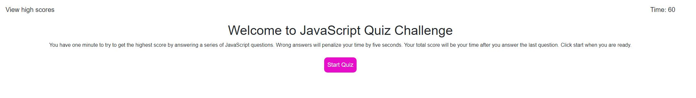
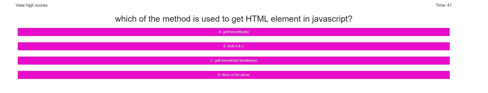
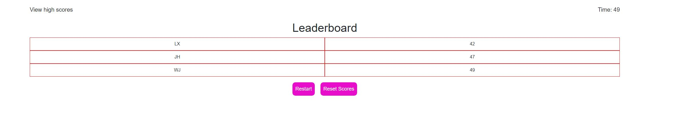

# javaScript-quiz

This JavaScript quiz is to help anyone that wishes to take a timed quiz that will test their knowledge on the fundamentals of JavaScrpt. The site has been set up to randomize a set of questions where incorrect answers will subtract from the overall score that way you an gauge your personal improvement as well as compare scores with you peers that take it.

* On the front page you can start the quiz, see the time, and go to the top scores.

* After pressing start quiz you will be given one question at a time to answer regarding JavaScript

* You can view the leaderboard at anytime with the button at the top left or at the end of the quiz

## Deployment

You can visit the quiz here https://joshua-huggins.github.io/javascript-quiz/